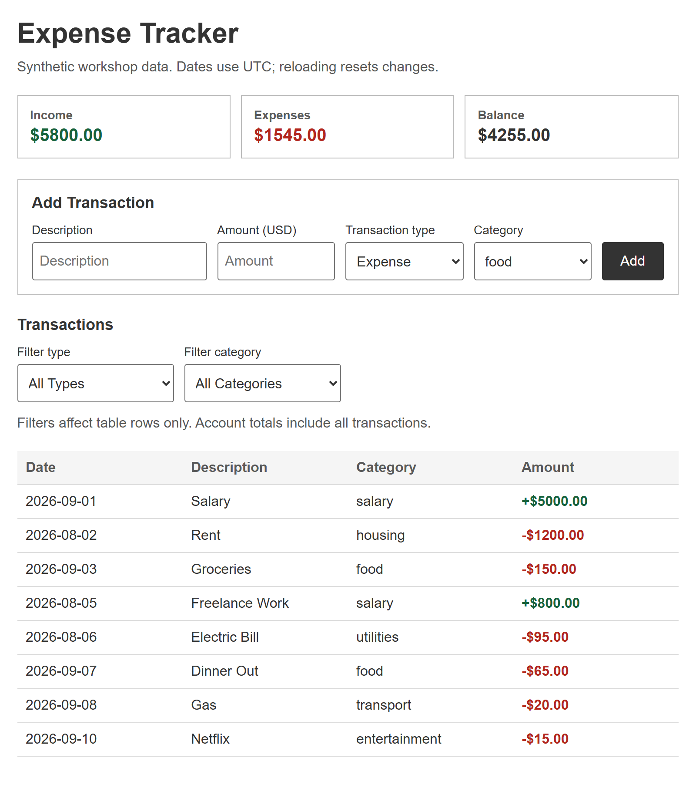
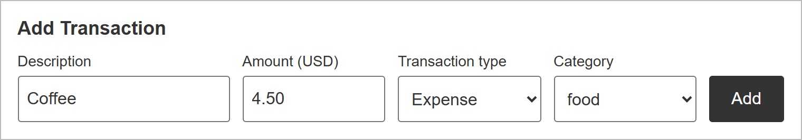

# Expense Tracker

A React/Vite app for recording income and expenses, viewing account totals, and filtering transactions by type and category. Filters affect table rows, not account totals.

Data is synthetic and stored in memory; reloading resets changes. There is no backend, persistence or account setup.

## Run locally

Use Node **22.23.0** (`.node-version`) and npm **11.0.0**. Run these commands from the repository root in Bash (Git Bash on Windows):

```bash
npm ci
npx playwright install chromium
npm run dev -- --host 127.0.0.1 --port 5173 --strictPort
```

Open **<http://127.0.0.1:5173/>**. Stop the server with Ctrl+C.

## Using the app

1. **View totals.** Check income, expenses and balance above the transaction list.

   

2. **Add a transaction.** Enter `Coffee`, amount `4.50`, type **Expense** and category **food**, then click **Add**.

   

3. **Filter rows.** Use **Filter type** and **Filter category**. Select **All Types** and **All Categories** to reset; totals stay unchanged.

Reloading resets changes.

## Checks

Run sequentially:

```bash
npm test
npm run lint
npm run build
```

Tests use a separate server on port **5174** and fail if it is occupied. Stop only your own processes.

## Chrome DevTools MCP

Lets your coding agent inspect and interact with the running app. Installed by the setup commands above; configured in [`.mcp.json`](.mcp.json).

Review and approve browser actions before running them.

## Credits

This workshop starter adapts code from [Mosh Hamedani's Expense Tracker starter](https://github.com/mosh-hamedani/expense-tracker-starter/tree/ebb746781495028051926213eb7ef6de5ce1cfe4).
